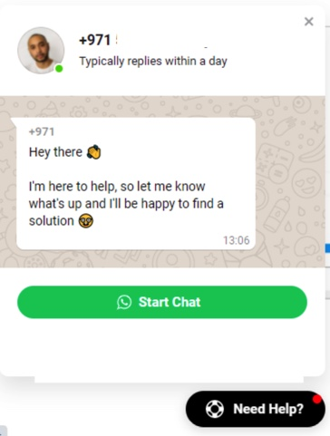
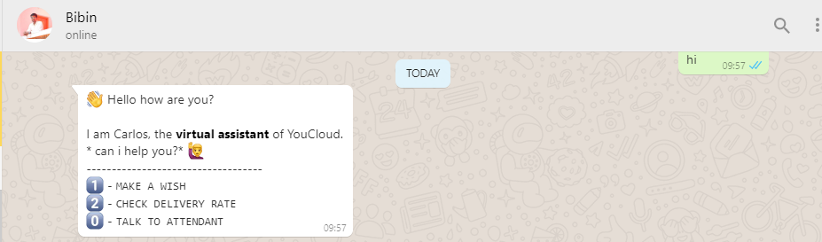
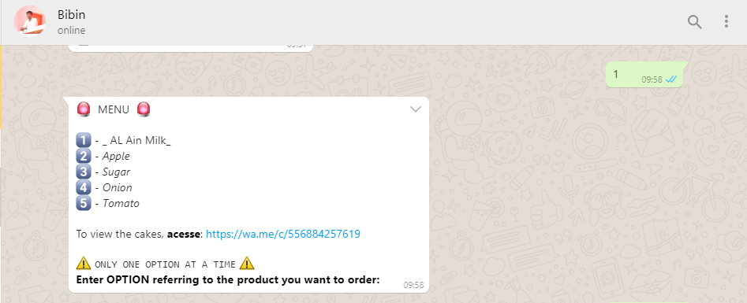
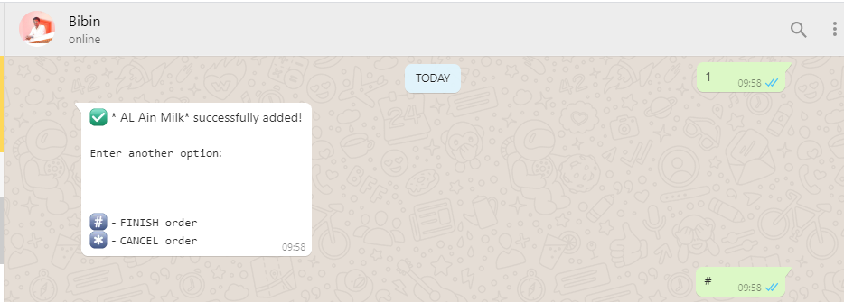
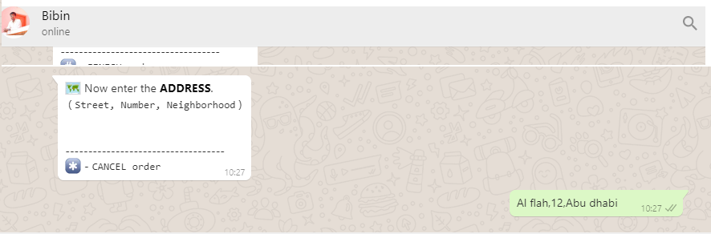
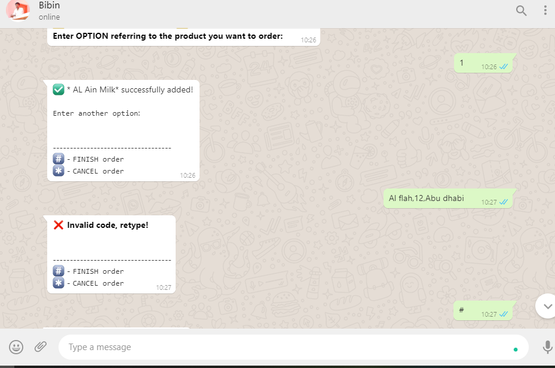

# Whatsapp Bot with VENOM-BOT

## Project description

<p align="center"></p>
<h1 align="center">
    <a href="https://nodejs.org/en/">🔗 NodeJS</a>
    <a href="https://www.npmjs.com/package/venom-bot">🧠 Venom Bot</a>
</h1>
<p align="center"> 


<a href="https://linkedin.com/">

</a>

</p>
<p align="center">🚀 Project created in order to assist in the demands of orders from  customers  via WhatsApp.
 Start Chat
</p>
<br>
<h1 align="center">
 Start Chat  
  
  Welcome
  
  Menu
  
  Order
  
  Address
  
  Bill
   
</h1>

### Prerequisites

Before starting, you will need to have the following tools installed on your machine:
[Git](https://git-scm.com), [Node.js](https://nodejs.org/en/).
Also, it's nice to have an editor to work with code like[VSCode](https://code.visualstudio.com/).

### 🎲 Running our application

```bash
# Clone this repository
$ git clone https://github.com/kdsmedia/ALTOSHOP
# Access the project folder in the terminal/cmd
$ cd ALTOSHOP

# install dependencies
$ npm install

# Run the application in development mode
$ yarn dev

## Ready, scan the QR code of Whatsapp and Voilà, enjoy!
```

### 🛠 Technologies

The following tools were used in the construction of the project:

- [Node.js](https://nodejs.org/en/)
 


### Author

---
  

Done with ❤️ by Sidhanie 👋🏽 !

<h3 align="left"></h3>
<p align="left">
<a href="https://linkedin.com/" target="blank"></a>
<a href="https://stackoverflow.com" target="blank"></a>
<a href="https://fb.com/" target="blank"></a>
<a href="https://medium.com/" target="blank"></a>
</p> 

<h3 align="left">Support:</h3>
<p><a href="https://www.buymeacoffee.com/"> </a></p><br><br>
<a href="https://blogsidhanie.blogspot.com/" target="blank">Sidhanie</a>

